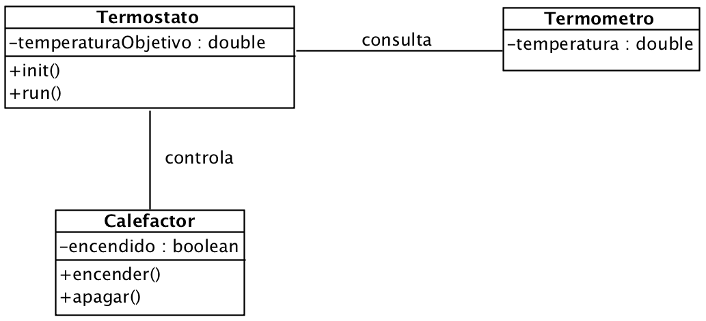

# Ejercicio 4 - Termostato

Queremos simular el funcionamiento de un termostato, siguiendo las especificaciones del siguiente diagrama de clases:

El funcionamiento del programa debe seguir estas pautas:

- El programa principal instancia un termostato y éste a su vez el termómetro y el calefactor.
- El programa principal llamará al método `init()` del termostato y éste pedirá al usuario la temperatura objetivo deseada para la habitación.
- Entonces se llamará al método `run()` y el termostato pedirá al termómetro la temperatura actual de la habitación. Éste contesta con un valor aleatorio comprendido entre -5 y +30 grados centígrados. 
- Si es necesario, el termostato encenderá el calefactor y mostrará como, grado a grado, aumenta la temperatura hasta alcanzar el objetivo. Entonces apagará el calefactor y terminará el proceso.
